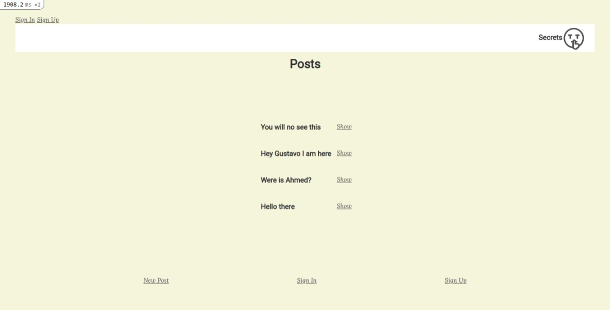

# AUTHENTICATION: Members Only!
 
> In this project, we created an exclusive clubhouse application using Ruby on Rails, including the model structure, associations, controllers, views, validations, and authentications, stylized with CSS.
- Consists of two models: User, Post.
- Only 'Sing Up' members are allowed to create posts and see others.
- Only each user is allowed to edit and delete his post.
With this application, sing up people can write their secrets, anyone without an account can see how to write the posts.

## Built With
- Ruby (v. 2.7.0)
- Ruby on Rails (v. 6.1.1)
- Rubocop
- Git
 
## Setup
- Run 'bundle install'
 
## How to run it
* It's recommended to use Git's latest version.
* Clone or download the repo from here [Members Only](https://github.com/AhmedAmin90/members-new-rails.git) on your local system.
* Unzip/Open the root folder, on the command line/terminal:
- Type: rails server / rails s
 
## Authors

**Ahmed Amin** :man_technologist:
- GitHub: [@AhmedAmin90](https://github.com/AhmedAmin90)
- LinkedIn: [Ahmed Amin](https://www.linkedin.com/in/web-developer/)

**Gustavo Sanmartin** :bird:
- GitHub: [@gasb150](https://github.com/gasb150)
- LinkedIn: [Gustavo Sanmartin](https://www.linkedin.com/in/gustavsanmartin/)

## Contribute :point_left:
Any advice and suggestion for improvement are more than welcome.
Visit [issues' section](https://github.com/AhmedAmin90/members-new-rails/issues)

## Show your support
Give a :star2: if you like this project!

## License

This project is <a href="../feature/LICENSE">MIT</a> licensed.
